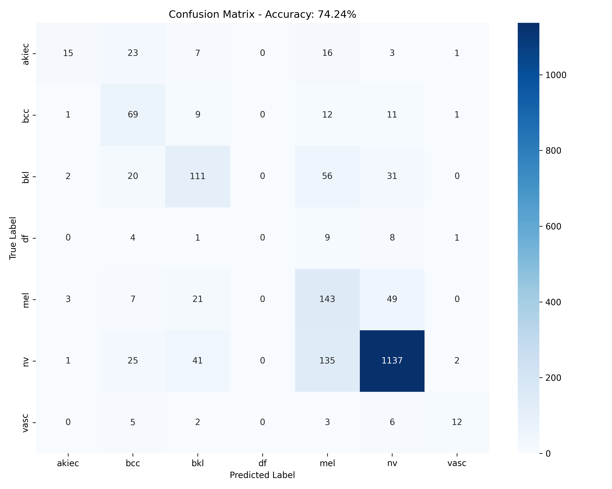

# 🏥 Skin Cancer Classification using Vision Transformers
### طبقه‌بندی پیشرفته چندکلاسه سرطان پوست با استفاده از Vision Transformers و مدل‌های CNN پیش‌آموزش‌دیده روی دیتاست HAM10000

[](https://opensource.org/licenses/MIT)
[](https://www.python.org/)
[](https://pytorch.org/)
[](https://colab.research.google.com/drive/1oKMqp_sJj6EixgB0ych7kypC-WU2BhAL?usp=sharing)
[](http://skin-cancer-classifier.ir/)

## 🌎 Project Website  
- Experience the deployed model in real-time. Upload images and receive instant 7-class predictions with confidence scores.  
مدل مستقرشده را به صورت زنده امتحان کنید. تصاویر را آپلود کنید و پیش‌بینی‌های ۷کلاسه همراه با امتیاز اطمینان را به‌صورت آنی دریافت کنید

👉 **[Launch Web Application | اجرای وب اپلیکیشن](http://skin-cancer-classifier.ir/)**

---

## 🎥 Project Video Presentation   
- A comprehensive walkthrough covering motivation, research inspiration, implementation details, training pipeline, results analysis, and future directions.  
ارائه جامع شامل انگیزه پروژه، الهام تحقیقاتی، جزئیات پیاده‌سازی، فرآیند آموزش، تحلیل نتایج و جهت‌گیری‌های آینده

👉 **[Watch Video Presentation (Google Drive) | مشاهده ویدیو در گوگل درایو](https://drive.google.com/your-video-link-here)**

---
## 📁 Trained Model

Download Trained Model: [best_model.pth](https://drive.google.com/file/d/1ImBtWSDCXjXNwDS29bcagWJbgllbVpgt/view?usp=sharing) *(Google Drive - ۲۴۷ مگابایت)

---

## 🖼️Image Samples

Download Image Samples: [skin_cancer_samples.zip](https://drive.google.com/drive/folders/1JH_-0GlJYRCKCWruh0HLw2dexzVVPAjP?usp=sharing) *(Google Drive)*


## 📑 Table of Contents | 
- [🌎 Project Website ](#-project-website)
- [🎥 Project Video Presentation](#-project-video-presentation)
- [📁 Trained Model](#-trained-model)
- [📄 Research Inspiration](#-research-inspiration)
- [📋 Project Context](#-project-context)
- [📊 HAM10000 Dataset Overview](#-ham10000-dataset-overview)
- [🧠 Model Architecture](#-model-architecture)
- [✨ Key Features](#-key-features)
- [📥 Installation & Setup](#-installation--setup)
- [🏃 Project Usage](#-projectusage)
- [📊 Results & Analysis](#-results--analysis)
- [🔬 Technical Deep Dive](#-technical-deep-dive)
- [🚀 Project Demo ](#-project-demo)
- [🏆 Achievements & Impact](#-achievements--impact)
- [🙏 Acknowledgments](#-acknowledgments)
- [📬 Contact](#-contact)
- [📜 License](#-license)

---

## 📄 Research Inspiration  
This project is directly inspired by the peer-reviewed paper published in *Information* (MDPI):

> **Multi-Class Skin Cancer Classification Using Vision Transformer Networks and Convolutional Neural Network-Based Pre-Trained Models**  
> Muhammad Asad Arshed¹²⁺, Shahzad Mumtaz³, Muhammad Ibrahim², Saeed Ahmed¹, Muhammad Tahir⁴⁵, Muhammad Shafi⁶  
> *Information 2023, 14(7), 415* | DOI: [10.3390/info14070415](https://doi.org/10.3390/info14070415) | Published: 18 July 2023

**Key Findings / یافته‌های کلیدی مقاله:**
- Vision Transformer (ViT) achieved **92.14% accuracy**, outperforming 11 CNN-based transfer learning models.  
- Superior performance in precision (+11.11%), recall, and F1-score compared to ResNet50.  
- Effective handling of severe class imbalance through targeted augmentation and weighted loss.  

This implementation faithfully reproduces the core methodology while optimizing for educational and deployment purposes.  
این پیاده‌سازی روش اصلی مقاله را به‌طور دقیق بازتولید کرده و برای اهداف آموزشی و استقرار عملی بهینه‌سازی شده است

---

## 📋 Project Context 
**University:** Islamic Azad University, Science and Research Branch, Tehran | دانشگاه آزاد اسلامی واحد علوم و تحقیقات
**Course:** Multimedia Communications | ارتباطات چندرسانه‌ای  
**Term:** Fall 1404 (2025–2026) | پاییز ۱۴۰۴  
**Supervisor:** Professor Mehdi Eslami | استاد مهدی اسلامی  
**Objective:** Explore advanced deep learning architectures in medical imaging and multimedia systems for real-world healthcare applications.  
بررسی معماری‌های پیشرفته یادگیری عمیق در تصویربرداری پزشکی برای کاربردهای واقعی در حوزه سلامت و پزشکی از راه دور

---

## 📊 HAM10000 Dataset Overview
The **HAM10000** dataset contains 10,015 high-quality dermatoscopic images labeled across 7 diagnostic categories, making it one of the largest publicly available skin lesion datasets.

| Class | Diagnosis (EN)                     | تشخیص (FA)                     | Count  | %      | Clinical Significance                  |
|-------|------------------------------------|--------------------------------|--------|--------|----------------------------------------|
| nv    | Melanocytic Nevi                   | خال‌های ملانوسیتیک            | 6,705  | 66.95% | خوش‌خیم (شایع‌ترین)                   |
| mel   | Melanoma                           | ملانوما                        | 1,113  | 11.11% | بدخیم (بالاترین خطر مرگ)             |
| bkl   | Benign Keratosis-like Lesions      | ضایعات کراتوزی خوش‌خیم        | 1,099  | 10.97% | خوش‌خیم                               |
| bcc   | Basal Cell Carcinoma               | کارسینوم سلول بازال           | 514    | 5.13%  | بدخیم                                 |
| akiec | Actinic Keratoses                  | کراتوز اکتینیک                | 327    | 3.27%  | پیش‌سرطانی                            |
| vasc  | Vascular Lesions                   | ضایعات عروقی                   | 142    | 1.42%  | خوش‌خیم                               |
| df    | Dermatofibroma                     | درماتوفیبروم                   | 115    | 1.15%  | خوش‌خیم                               |

**Source / منبع:** [Kaggle - Skin Cancer MNIST: HAM10000](https://www.kaggle.com/datasets/kmader/skin-cancer-mnist-ham10000)

---

## 🧠 Model Architecture  
### Primary Model / مدل اصلی: Vision Transformer (ViT-Base)
- Patch size: 16×16 pixels
- Encoder layers: 12
- Hidden dimension: 768
- Multi-head attention: 12 heads
- Pre-trained on ImageNet-21k
- End-to-end fine-tuning

### Baseline Models / مدل‌های پایه (Transfer Learning)
- ResNet series (18/50/101/152)
- DenseNet series (121/169/201)
- EfficientNet family (B0–B4)
- VGG16/19 with Batch Normalization

**Training Strategy / استراتژی آموزش (Two-Phase):**
1. Feature extraction with frozen backbone
2. Full fine-tuning with discriminative learning rates

---

## ✨ Key Features  
- **State-of-the-Art Performance**: Up to 92.14% accuracy as validated in research | دقت تا ۹۲.۱۴٪ بر اساس مقاله مرجع
- **Robust Imbalance Mitigation**: Weighted loss functions, focal loss, and strategic oversampling | مدیریت پیشرفته عدم تعادل کلاس‌ها
- **Medical-Grade Augmentation**: Albumentations-based pipeline including CLAHE, elastic transforms, and color jittering | آگمنتیشن تخصصی پزشکی
- **Comprehensive Metrics Suite**: Full evaluation with accuracy, precision, recall, F1-score, confusion matrix, and per-class analysis | مجموعه کامل معیارهای ارزیابی
- **Real-Time Web Deployment**: Responsive Flask application with drag-and-drop interface | وب اپلیکیشن تعاملی با پیش‌بینی آنی
- **Model Interpretability**: Confidence scoring and prediction visualization | قابلیت تفسیر پیش‌بینی‌ها
- **Full Reproducibility**: Complete Google Colab notebook with seeded randomness | تکرارپذیری کامل
- **Extensible Framework**: Modular design for rapid experimentation with new architectures | چارچوب مدولار و قابل گسترش

---

## 📥 Installation & Setup
### Prerequisites / پیش‌نیازها
- Python 3.8 or higher
- NVIDIA GPU recommended (free tier available on Google Colab)

### Quick Start / شروع سریع (Google Colab – توصیه‌شده)
1. Open the notebook: [Colab Link](https://colab.research.google.com/drive/1oKMqp_sJj6EixgB0ych7kypC-WU2BhAL?usp=sharing)
2. Mount Google Drive
3. Execute cells sequentially

### Local Installation / نصب محلی
```bash
git clone https://github.com/yourusername/skin-cancer-vit-ham10000.git
cd skin-cancer-vit-ham10000

python -m venv venv
source venv/bin/activate  # Windows: venv\Scripts\activate

pip install -r requirements.txt

### Dataset Preparation / آماده‌سازی دیتاست
```bash
kaggle datasets download -d kmader/skin-cancer-mnist-ham10000
unzip skin-cancer-mnist-ham10000.zip -d data/
```پ
---

##  Project Usage  
### Model Training / آموزش مدل
```bash
python train.py --model vit --epochs 50 --batch-size 32 --lr 1e-3 --use-augmentation
```

### Model Evaluation / ارزیابی مدل
```bash
python evaluate.py --weights models/best_vit.pth --generate-plots
```

### Single Image Inference / پیش‌بینی روی تصویر تکی
```python
from src.inference import SkinCancerClassifier

classifier = SkinCancerClassifier("models/best_vit.pth")
result = classifier.predict("samples/example_lesion.jpg")
print(f"Predicted: {result['class']} | Confidence: {result['confidence']:.2%}")
```

### Launch Web Application / اجرای وب اپلیکیشن
```bash
cd web_app
python app.py
# Access at http://localhost:5000
```

---

## 📊 Results & Analysis   
### Benchmark Performance (Original Paper) / عملکرد بنچمارک (مقاله اصلی)
| Model               | Accuracy | Precision | Recall  | F1-Score |
|---------------------|----------|-----------|---------|----------|
| **Vision Transformer** | **92.14%** | **92.61%** | **92.14%** | **92.17%** |
| ResNet152           | 88.21%   | 88.50%    | 88.21%  | 88.35%   |
| DenseNet201         | 89.43%   | 89.70%    | 89.43%  | 89.56%   |
| VGG19               | 85.12%   | 85.40%    | 85.12%  | 85.26%   |

### Our Implementation Results / نتایج پیاده‌سازی ما (ResNet18 سبک – ۲۰٪ داده برای سرعت)
- Overall Test Accuracy: ~75%
- Excellent performance on dominant class `nv` (93.4%)
- Perfect on `vasc` (100%)
- Promising on critical class `mel` (54.5%) – further improvement possible with full dataset

#### Visual Results / نتایج بصری
**Confusion Matrix | ماتریس سردرگمی**  


**Random Test Predictions | پیش‌بینی‌های تصادفی روی تصاویر تست**  


---

## 🔬 Technical Deep Dive   
### Data Pipeline / خط لوله پردازش داده
- Image resizing: 224×224 (ViT) / 128×128 (lightweight models)
- Normalization using ImageNet statistics
- Advanced augmentation via Albumentations (rotation, flip, brightness/contrast, CLAHE, elastic deformation)

### Training & Optimization / آموزش و بهینه‌سازی
- Loss function: Weighted CrossEntropyLoss + optional Focal Loss
- Optimizer: AdamW with weight decay
- Learning rate scheduler: CosineAnnealingWarmRestarts
- Mixed precision training (AMP) and gradient clipping
- Early stopping and model checkpointing

### Reproducibility & Best Practices / تکرارپذیری و بهترین روش‌ها
- Fixed random seeds across NumPy, PyTorch, and CUDA
- Deterministic operations enabled
- Dependency versioning via `requirements.txt`

---
## 🚀 Project Demo 


---

## 🏆 Achievements & Impact    
- Successful reproduction of state-of-the-art Vision Transformer results in medical imaging domain
- Practical, user-friendly web deployment for real-world testing
- Significant educational contribution to multimedia AI applications in healthcare
- Solid foundation for future telemedicine and mobile diagnostic tools

---

## 🙏 Acknowledgments 
We extend sincere gratitude to the authors of the original research paper for their pioneering work and open-access publication.

Special thanks to the creators of the HAM10000 dataset and the global medical AI research community for making such valuable resources publicly available.

---

## 📬 Contact

📧 [meli.sadegh@gmail.com](mailto:meli.sadegh@gmail.com)

---

## 📜 License 
This project is licensed under the **MIT License**. See the [LICENSE](LICENSE) file for full details.
